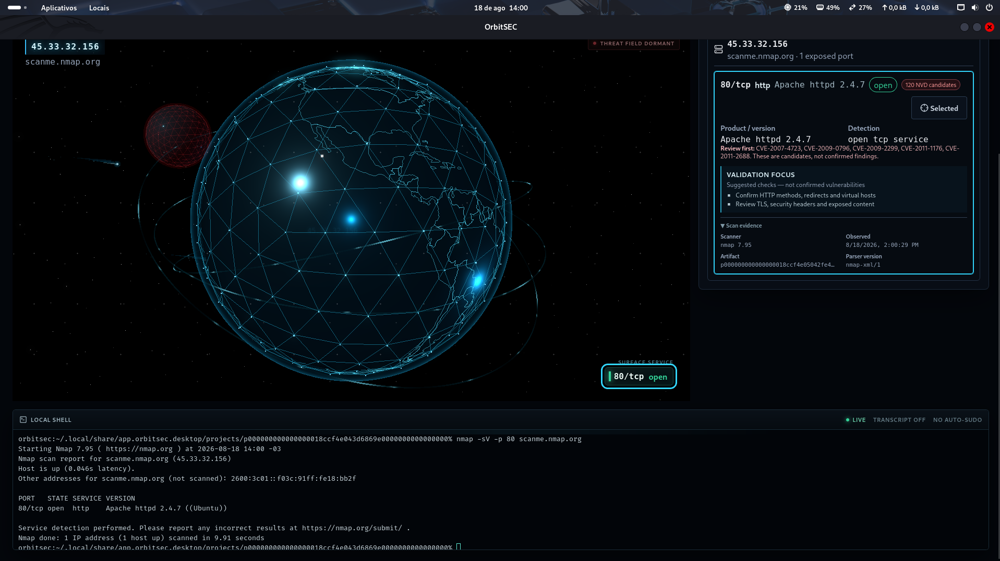

# OrbitSEC

Cockpit local de investigação visual de segurança para Kali Linux.



> Repositório público de apresentação. O código-fonte e os detalhes sensíveis de proteção permanecem privados.

## Visão

O OrbitSEC transforma observações estruturadas de ferramentas de segurança em uma área de investigação visual, rastreável e acessível. O projeto busca reduzir a distância entre comandos executados no laboratório, evidências coletadas e decisões tomadas durante uma análise.

O foco inicial é o uso autorizado em CTFs, laboratórios pessoais e ambientes de estudo.

## Fluxo atual

```text
Comando iniciado pelo usuário
        ↓
Validação do escopo autorizado
        ↓
Saída estruturada da ferramenta
        ↓
Parser limitado e validação de esquema
        ↓
Eventos normalizados com rastreabilidade
        ↓
Estado da investigação
        ↓
Visualização 3D + painel acessível + contexto
```

## Funcionalidades demonstradas

- Aplicação desktop construída com Tauri 2.
- Backend em Rust e interface em React com TypeScript.
- Terminal local integrado, gerenciado por PTY.
- Importação limitada e validada de XML do Nmap.
- Modelo de escopo autorizado para integrações compatíveis.
- Eventos tipados com origem, operação, artefato e projeto.
- Visualização 3D de hosts e serviços.
- Painel acessível alimentado pelo mesmo estado da visualização.
- Sincronização de seleção e suporte a movimento reduzido.
- Sugestões determinísticas de validação por serviço.
- Separação explícita entre observação, hipótese, CVE candidata e achado confirmado.
- Persistência local de projetos em desenvolvimento.

## Decisões de arquitetura

### Saída estruturada em vez de leitura do terminal

Texto de terminal é produzido para pessoas e pode variar conforme cores, idioma, versão da ferramenta e comportamento interativo. O OrbitSEC usa formatos documentados e legíveis por máquina como fonte de fatos da investigação.

### Um modelo de fatos, várias visualizações

O universo 3D e o painel acessível projetam o mesmo estado validado. A experiência visual não cria uma segunda fonte de verdade.

### Rastreabilidade antes da automação

Cada observação conserva sua relação com operação, artefato, parser e projeto. Assim, um host ou serviço visualizado pode ser explicado e revisado.

### Sugestões não são achados

Uma versão informada ou uma CVE candidata justifica investigação, mas não comprova vulnerabilidade. A interface preserva essa distinção.

### Privacidade local por padrão

Projetos de laboratório podem conter alvos, comandos, evidências e anotações sensíveis. O OrbitSEC não utiliza armazenamento hospedado ou telemetria em sua arquitetura inicial.

## Modelo de proteção

| Camada | Responsabilidade |
|---|---|
| Escopo autorizado | Limitar integrações ativas ao laboratório declarado. |
| Validação estruturada | Rejeitar entradas malformadas ou excessivas. |
| Rastreabilidade | Preservar a origem de cada observação. |
| Separação de projetos | Isolar estados de investigações independentes. |
| Limite de segredos do sistema operacional | Separar material de acesso do conteúdo do projeto. |
| Proteção autenticada em repouso | Manter confidencialidade e detectar alterações. |
| Ciclo de sessão | Reduzir estado sensível desnecessário em memória. |

Este repositório não publica formatos internos, parâmetros, chaves, identificadores, recuperação ou implementação sensível.

## Tecnologias

| Área | Tecnologia |
|---|---|
| Desktop | Tauri 2 |
| Backend | Rust |
| Interface | React e TypeScript |
| Build | Vite |
| Terminal | xterm.js e portable-pty |
| Visualização | Three.js e React Three Fiber |
| Parsing estruturado | quick-xml |
| Persistência | SQLite |
| Testes | Vitest, Testing Library e testes Rust |

## Verificação do snapshot

O snapshot usado nesta apresentação passou por:

- 15 testes de frontend.
- 42 testes unitários em Rust.
- 8 testes de integração em Rust.
- 50 testes Rust no total, sem falhas.
- Auditoria Git de artefatos sensíveis.
- Validação de espaços em branco no diff.

Essas verificações não equivalem a uma auditoria de segurança independente ou certificação de produção.

## Demonstração segura

As demonstrações públicas usam somente dados sintéticos:

1. Criar um projeto descartável e autorizado.
2. Importar uma fixture XML sintética do Nmap.
3. Visualizar hosts e serviços no universo 3D.
4. Selecionar um serviço no painel acessível.
5. Revisar origem, sugestões e CVEs candidatas.
6. Demonstrar a rejeição de entradas malformadas ou excessivas.

Alvos reais, credenciais, flags, transcrições, bancos e evidências nunca são incluídos neste repositório.

### Vídeo de apresentação

[](media/orbitsec-demonstracao.mp4)

[▶ Assistir ao vídeo original em maior qualidade](media/orbitsec-demonstracao.mp4)

O vídeo apresenta o workspace autorizado, o terminal local integrado, a execução controlada do Nmap e a projeção dos resultados na interface de investigação. A gravação foi revisada para publicação e não contém credenciais ou evidências privadas.

## Direção de IA

O OrbitSEC Copilot é planejado como camada opcional de explicação, não como agente ofensivo autônomo. Ele deverá explicar observações, resumir notas aprovadas pelo usuário, sugerir perguntas de validação e citar o contexto utilizado. Não executará comandos silenciosamente nem enviará evidências para provedores remotos por padrão.

Leia a [direção de integração com IA](docs/ai-direction.md).

## Roadmap

O planejamento público está em [ROADMAP.md](ROADMAP.md).

## Política de publicação

Este repositório contém apenas documentação pública, roadmap, diagramas sanitizados e mídia sintética revisada. Ele não contém código da aplicação, histórico privado, detalhes criptográficos, scans reais, evidências, credenciais, bancos ou configurações locais.

## Uso responsável

O OrbitSEC destina-se a CTFs, laboratórios pessoais, educação e sistemas nos quais o operador possui autorização explícita. O projeto não incentiva nem automatiza acesso não autorizado.

## Estado

O OrbitSEC está em desenvolvimento ativo como projeto de portfólio em segurança, engenharia desktop, visualização e IA aplicada. Interfaces e comportamentos podem mudar antes da primeira distribuição.
